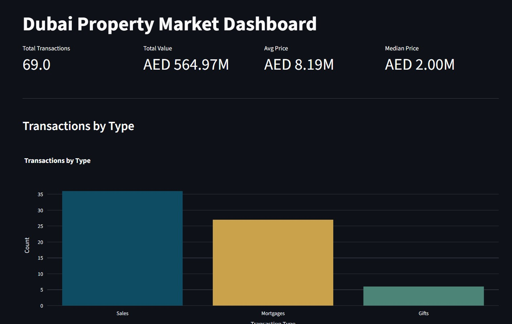
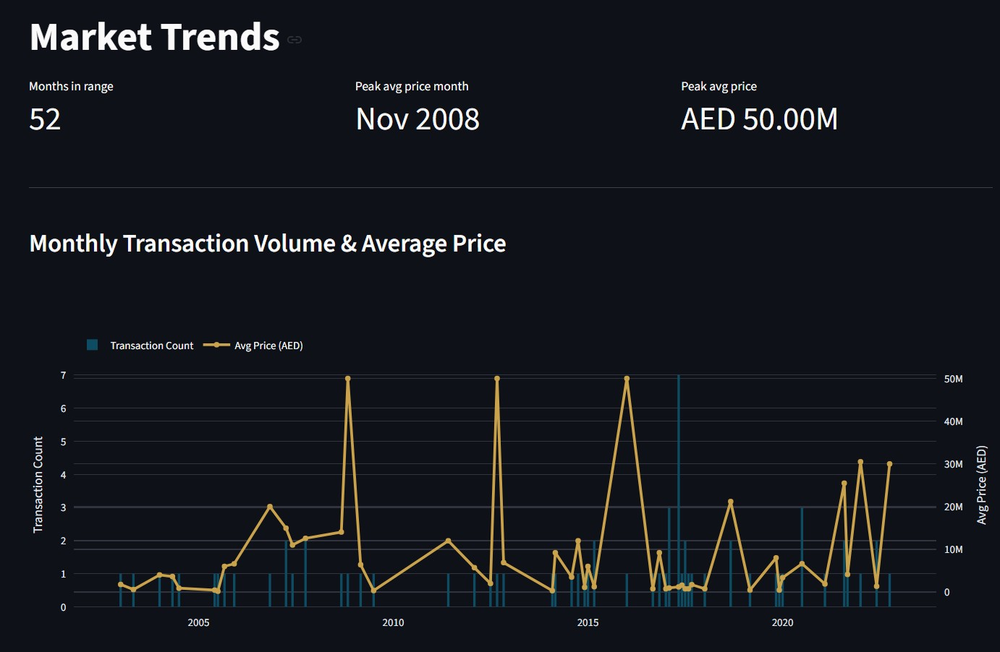
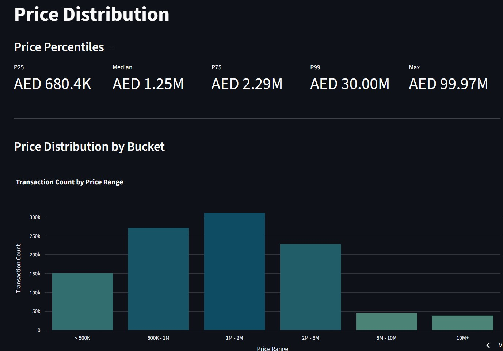
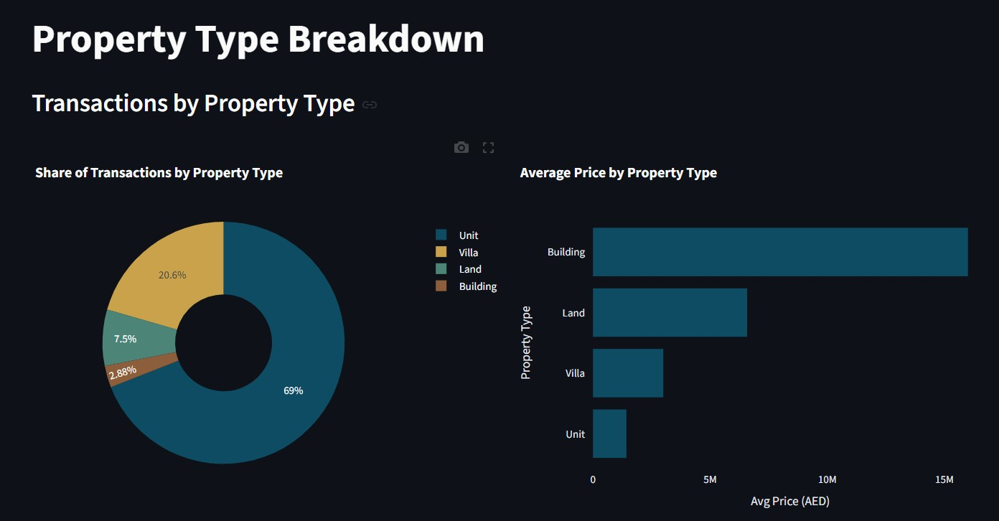

# Dubai Property Market Dashboard

An interactive dashboard for exploring Dubai Land Department (DLD) property transaction data, built with DuckDB for analytics and Streamlit for the UI.

 **Live app:** [dubai-property-dashboard.streamlit.app](https://dubai-property-dashboard-gdwkz3kkuajevf3pstnd6d.streamlit.app)

---


## Features

- **Overview** — total transactions, total value, avg/median price, transaction-type breakdown
- **Trends** — monthly volume & price chart, month-over-month change, 3-month rolling average
- **Area Analysis** — top-10 area rankings, price-per-sqft vs. market average, price volatility, area × property-type pivot heatmap
- **Property Types** — transaction share by type, average price by type, parking price comparison
- **Distribution** — percentile summary, price-bucket histogram, top 1% outlier transactions
- Global date/area/property-type filters, persisted across all pages
- CSV export on every page


---

## Tech Stack


---

## Data Source

Transaction-level data from the [Dubai Land Department](https://dubailand.gov.ae/) open transactions dataset (via Dubai Pulse), covering sales, rentals, and mortgage procedures with fields for area, property type, price, size, and more.

---

## Data Pipeline

1. **Ingestion** — raw CSV loaded directly into DuckDB with `read_csv_auto`
2. **Schema fixes** — type corrections (e.g. `actual_worth` cleaned from text to `DOUBLE`, `has_parking` cast to boolean, `instance_date` cast to `DATE`)
3. **Cleaning view** (`vw_transactions_clean`) — drops Arabic-language duplicate columns, filters out rows missing core analytical fields (date, price, area, property type)
4. **Purpose-built views** — `vw_area_summary`, `vw_monthly_trend`, `vw_property_type_breakdown`, `vw_projects_lookup`, etc., each feeding a specific dashboard page
5. **Dashboard layer** — Streamlit pages query these views with dynamic `WHERE` clauses built from sidebar filter selections

SQL techniques used throughout: window functions (`LAG`, rolling averages via `ROWS BETWEEN`), `PERCENTILE_CONT`, `STDDEV`, `QUALIFY`, and DuckDB's native `PIVOT` statement.

---

## Screenshots

| Overview | Trends |
|---|---|
|  |  |

| Distribution | Property Types |
|---|---|
|  |  |

---

## Project Structure

```
dubai_property_dashboard/
├── data/                       
├── db/
│   └── dubai_property.duckdb    
├── sql/
│   ├── 01_schema_fixes.sql
│   ├── 02_views.sql
│   └── queries/                 
├── utils/
│   ├── db.py                    
│   ├── filters.py                
│   ├── format.py                 
│   └── theme.py                  
├── pages/
│   ├── trends.py
│   ├── area_analysis.py
│   ├── property_types.py
│   └── distribution.py
├── app.py                       
├── requirements.txt
└── README.md
```

---

## Running Locally

```bash
# clone the repo
git clone https://github.com/Shreiya-Muthuvelan/dubai-property-dashboard.git
cd dubai-property-dashboard

# install dependencies
pip install -r requirements.txt

# run the app
streamlit run app.py
```

The app reads from `db/dubai_property.duckdb`, which is committed to this repo — no separate data setup is required to run it locally.

---


